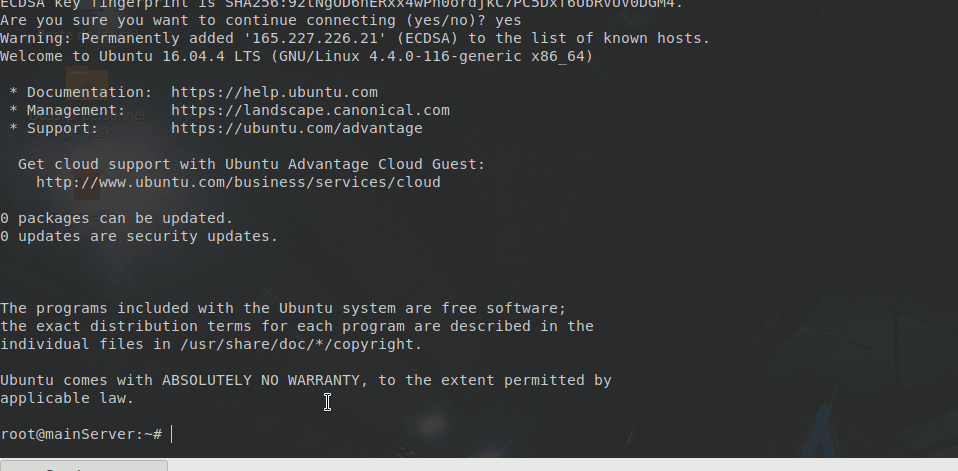
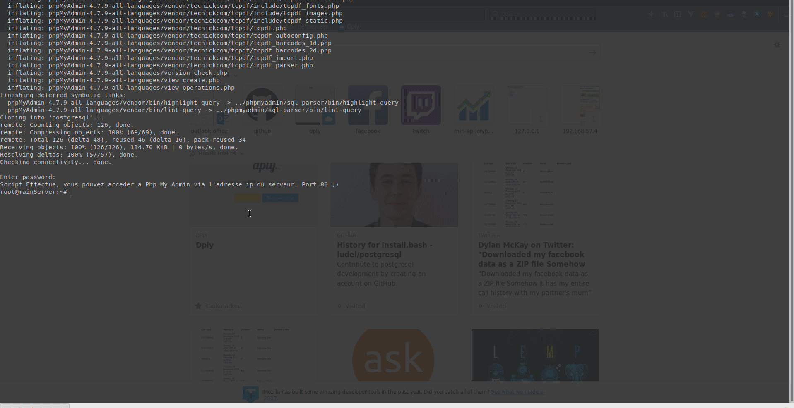

# Cours : Postgresql
### By **Ludovic Delsol** & **Dorian Wilhelm**

|Techno.            |Version |
|----------------   |-------------------------------|
|OS - Ubuntu        |16.0.4 Lts                     |
|PhpMyAdmin         |4.7.9                          |
|Php - fpm          |7.0                            |
|Python             |3.6                            |

## Ce que fait mon script d'installation
Ce script permets de deployer rapidement:
- un serveur http **nginx**
- un serveur **php-fpm**
- un serveur de donnee base de **mariadb**
- le site **PhpMyAdmin**
- injecter 1000 entrees dans notre base de donnee *(au nom de **foo** table **data**)*

## Comment utiliser / run le script

Comme l'exemple ci-dessus le montre ,  
Pour lancer le script il faut se connecter en ssh sur la machine cible, ensuite copier le [code ici](https://github.com/ludel/mysqlManager/blob/master/install.bash),   
ensuite il faut ouvrir un editeur de text en cli (***vim*** / ***nano***) dans l'exemple juste au dessus ***VIM*** est utilise.  

